# my-example — multi-engine batch model generation

Spreadsheet-driven ForgeCAD model generation that runs the **same prompt** against multiple agent + model combos (currently Claude Sonnet/Opus and Codex GPT) and saves each as its own project under `projects/{slug}/{engine}/`. Renders 4 canonical stills + a 180° turntable GIF per project.

## Results gallery

<!-- RESULTS_GALLERY_START -->
<!-- auto-generated by generate.mjs on 2026-05-17 01:58:56 — 27 result(s). DO NOT EDIT BY HAND between these markers. -->

| prompt | reference | model | outcome (turntable) |
|---|---|---|---|
| **analogue-pocket-aluminum**<br>Analogueによる携帯型レトロゲーム機のアルミ削り出し限定版。約75x150x20mmの縦長ボディ、上部に正方形のディスプレイ、下部に十字キーと4つの丸ボタン、サイドにショルダーボタン2つ。サンドブラストアルミ仕上げ。 | 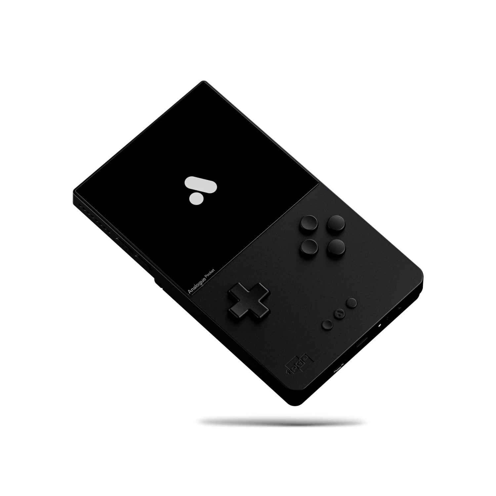 | `claude-opus-4.7` | 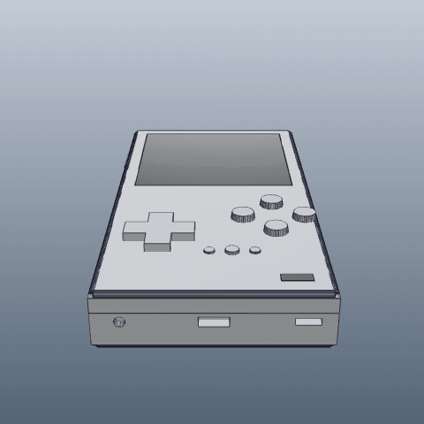 |
| **analogue-pocket-aluminum**<br>Analogueによる携帯型レトロゲーム機のアルミ削り出し限定版。約75x150x20mmの縦長ボディ、上部に正方形のディスプレイ、下部に十字キーと4つの丸ボタン、サイドにショルダーボタン2つ。サンドブラストアルミ仕上げ。 |  | `codex-gpt-5.5` | 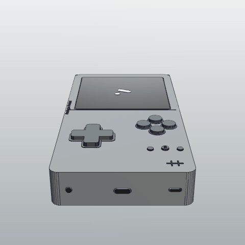 |
| **candle-holder-001**<br>テーパーキャンドル用のホルダー。底面φ70mm、高さ40mm。中央に直径22mmの穴。重厚感のある真鍮風。フチに微妙な装飾溝。 | — | `claude-opus-4.7` | 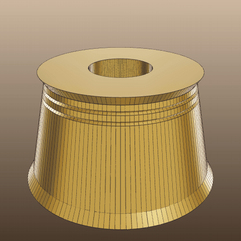 |
| **candle-holder-001**<br>テーパーキャンドル用のホルダー。底面φ70mm、高さ40mm。中央に直径22mmの穴。重厚感のある真鍮風。フチに微妙な装飾溝。 | — | `codex-gpt-5.5` | 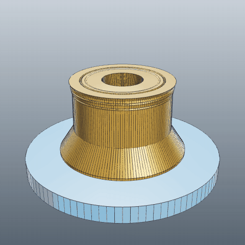 |
| **cuboid-black**<br>Kordによる日常品を再考したコンパクトな立方体型プロダクト。約120x120x120mmのキューブ形状、マットブラック仕上げ、ミニマルで控えめな存在感、精緻なディテールを持つ。 | 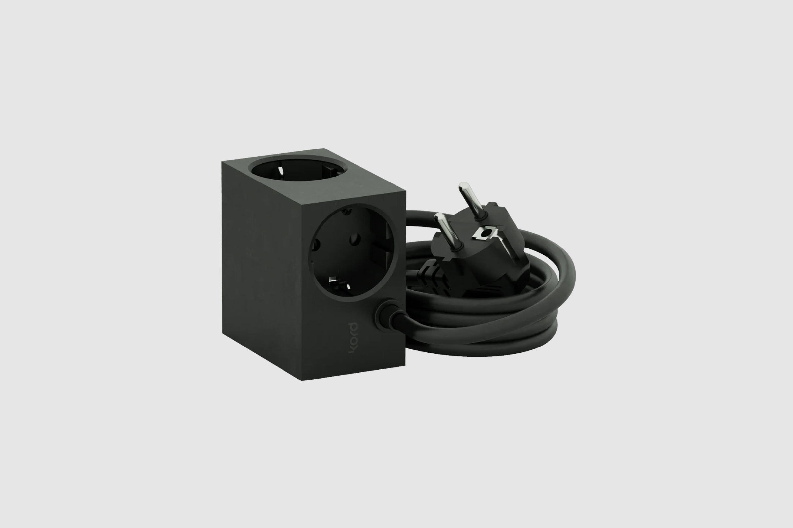 | `claude-opus-4.7` | 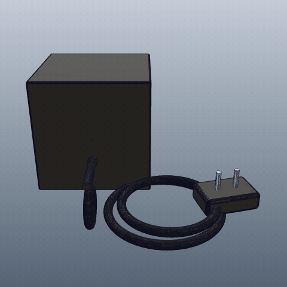 |
| **cuboid-black**<br>Kordによる日常品を再考したコンパクトな立方体型プロダクト。約120x120x120mmのキューブ形状、マットブラック仕上げ、ミニマルで控えめな存在感、精緻なディテールを持つ。 |  | `codex-gpt-5.5` | 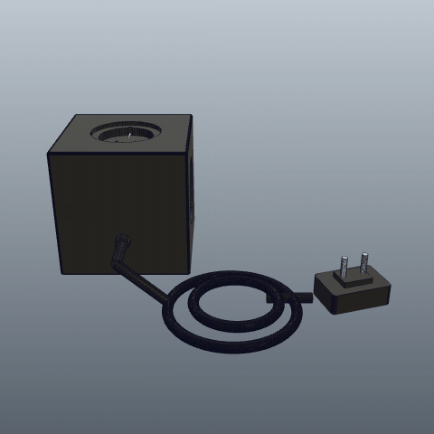 |
| **desk-clock-001**<br>卓上アナログ時計。直径80mm、厚み25mm。文字盤は12個のマーカーのみ（数字なし）、短針・長針・秒針を持つ。台座は無し（壁掛け想定）。全体はマットな黒のミニマルデザイン。 | — | `claude-opus-4.7` | 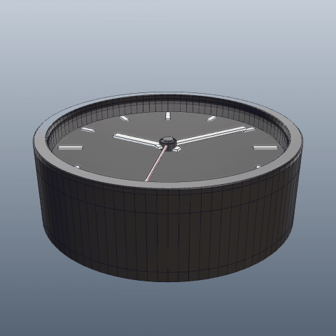 |
| **desk-clock-001**<br>卓上アナログ時計。直径80mm、厚み25mm。文字盤は12個のマーカーのみ（数字なし）、短針・長針・秒針を持つ。台座は無し（壁掛け想定）。全体はマットな黒のミニマルデザイン。 | — | `claude-sonnet` | 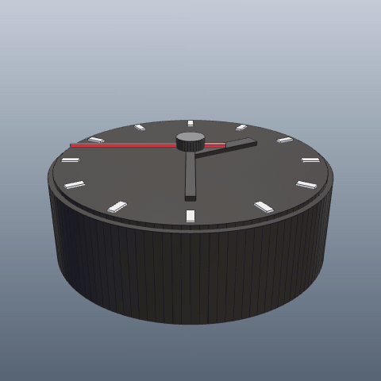 |
| **desk-clock-001**<br>卓上アナログ時計。直径80mm、厚み25mm。文字盤は12個のマーカーのみ（数字なし）、短針・長針・秒針を持つ。台座は無し（壁掛け想定）。全体はマットな黒のミニマルデザイン。 | — | `codex-gpt-5.5` | 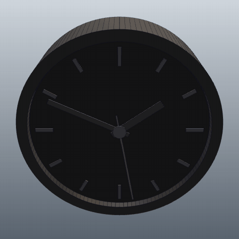 |
| **herman-miller-powerbox**<br>Future Facilityによる携帯型の共有高容量モバイルバッテリー。約100x60x20mmの角丸長方形ボディ、4ポートのUSB出力で複数デバイスを同時充電可能。表面はマットなライトグレー、ミニマルで道具的な佇まい。 | 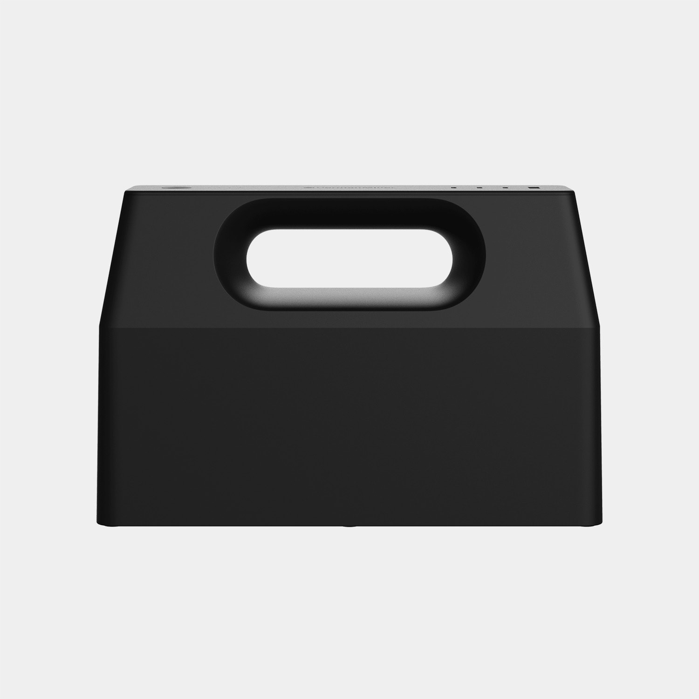 | `claude-opus-4.7` | 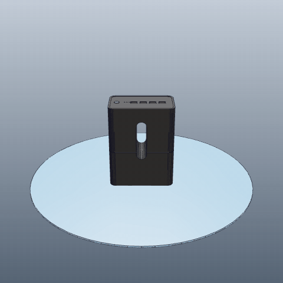 |
| **herman-miller-powerbox**<br>Future Facilityによる携帯型の共有高容量モバイルバッテリー。約100x60x20mmの角丸長方形ボディ、4ポートのUSB出力で複数デバイスを同時充電可能。表面はマットなライトグレー、ミニマルで道具的な佇まい。 |  | `codex-gpt-5.5` | 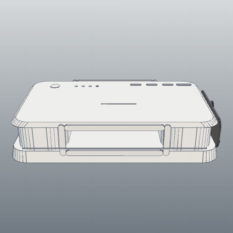 |
| **kombu**<br>KOMBUによる家庭用コンブチャ醸造器「Fermenstation」。円筒形ボディ直径約180mm、高さ約300mm、上部に丸いリッド、前面に小さな注ぎ口とディスプレイ。マットなオフホワイトとウォームグレーの2トーン、家電的でないオブジェクトとしての佇まい。 | 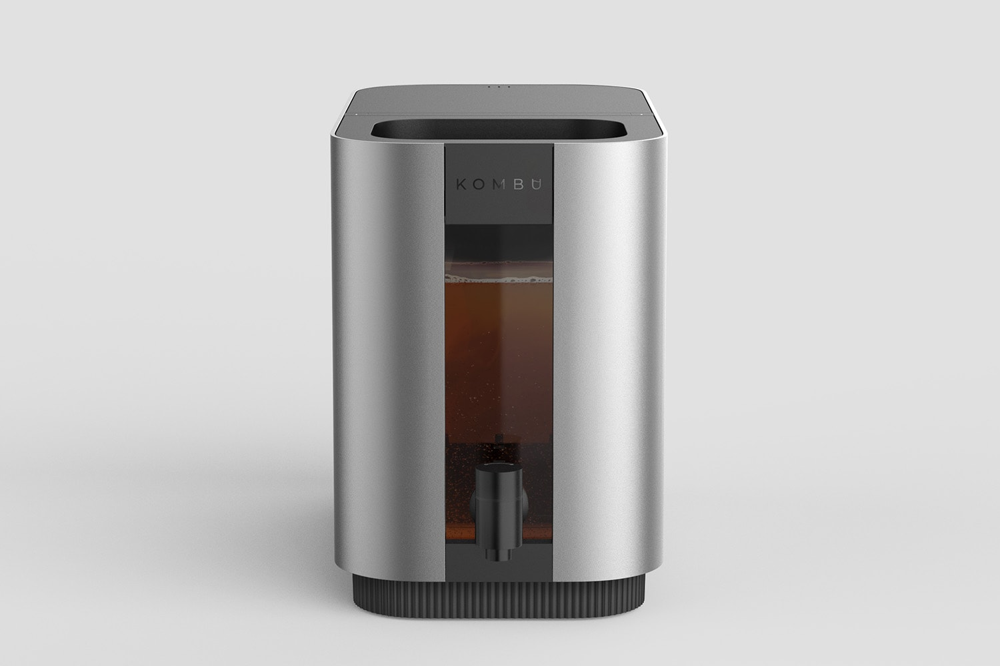 | `claude-opus-4.7` | 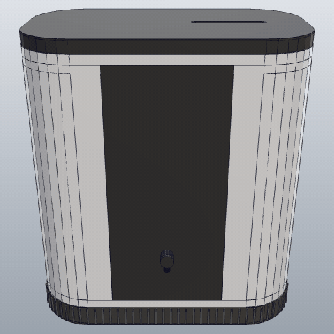 |
| **kombu**<br>KOMBUによる家庭用コンブチャ醸造器「Fermenstation」。円筒形ボディ直径約180mm、高さ約300mm、上部に丸いリッド、前面に小さな注ぎ口とディスプレイ。マットなオフホワイトとウォームグレーの2トーン、家電的でないオブジェクトとしての佇まい。 |  | `claude-sonnet` | 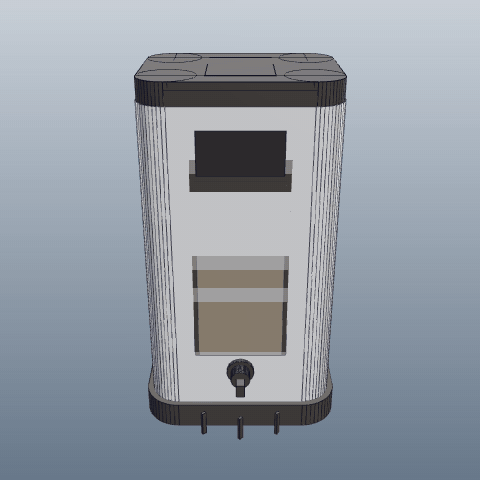 |
| **kombu**<br>KOMBUによる家庭用コンブチャ醸造器「Fermenstation」。円筒形ボディ直径約180mm、高さ約300mm、上部に丸いリッド、前面に小さな注ぎ口とディスプレイ。マットなオフホワイトとウォームグレーの2トーン、家電的でないオブジェクトとしての佇まい。 |  | `codex-gpt-5.5` | 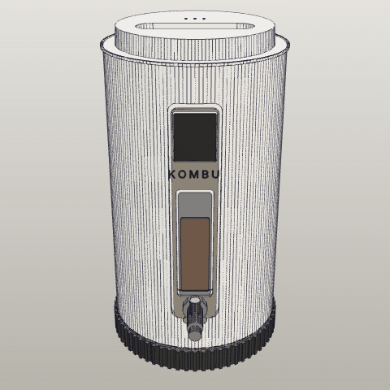 |
| **link-one-watch**<br>Johan Linkによるミニマルな腕時計「Link One」。ケース径38mm、厚み8mm、文字盤はインデックスのみで数字なし、針は2本（時針・分針）。ケースとブレスレットはステンレス、サテン仕上げ。リューズは控えめなサイズ。 | 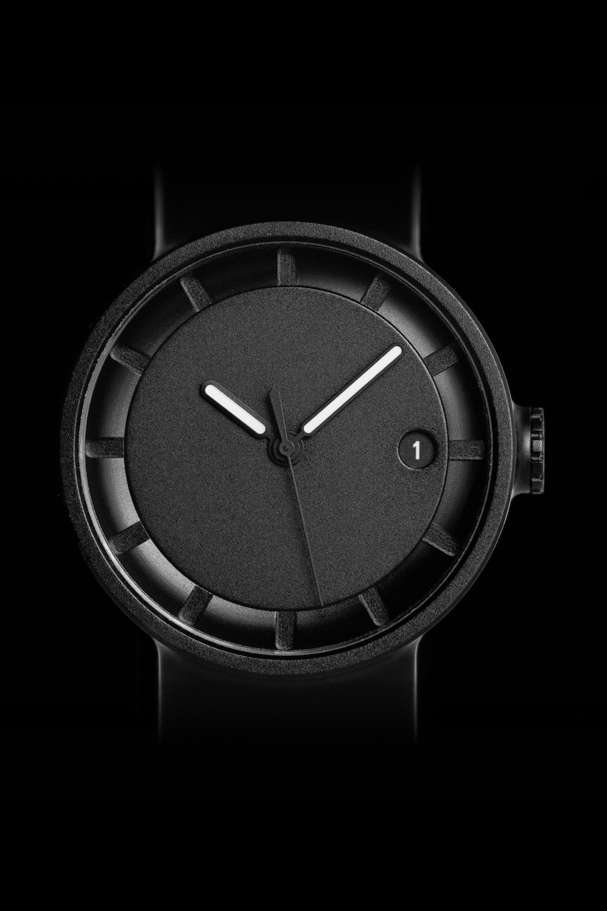 | `claude-opus-4.7` | 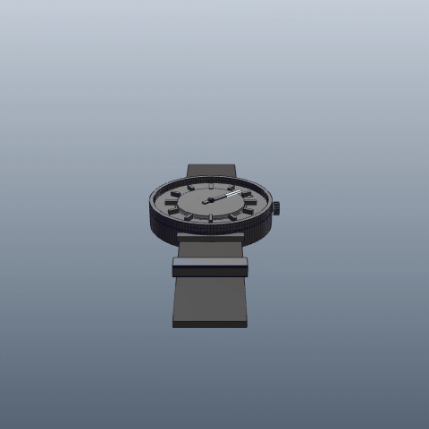 |
| **mardi-mercredi-store**<br>CREATIVE STUDIO UNRAVELによるアパレル店舗の什器をモチーフにした什器ユニット。約1800x600x400mmの直方体ベンチ／ディスプレイ台、スチール脚と薄いトップ天板、マットなオフホワイト塗装。ミニマルで建築的なフォルム。 | 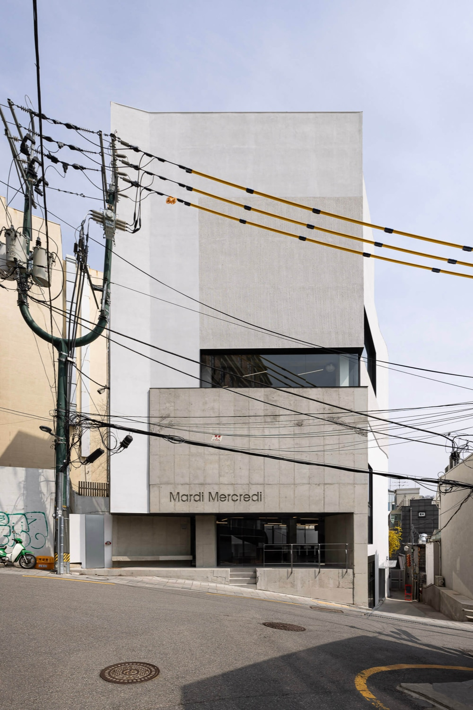 | `claude-opus-4.7` | 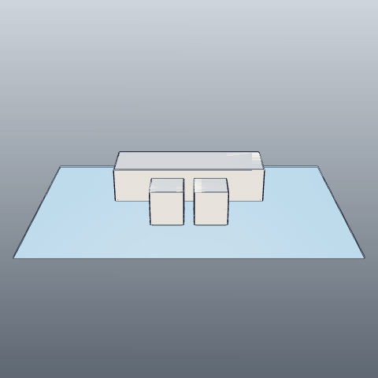 |
| **mardi-mercredi-store**<br>CREATIVE STUDIO UNRAVELによるアパレル店舗の什器をモチーフにした什器ユニット。約1800x600x400mmの直方体ベンチ／ディスプレイ台、スチール脚と薄いトップ天板、マットなオフホワイト塗装。ミニマルで建築的なフォルム。 |  | `codex-gpt-5.5` | 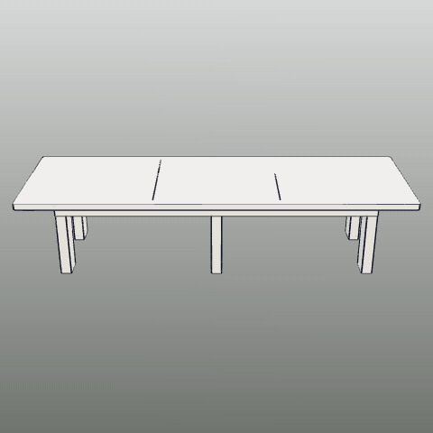 |
| **naust**<br>Espen Surnevikによる切妻屋根のボートハウス（ナウスト）形状の小さな建築模型。基本寸法 約200x100x120mm、急勾配の三角屋根、木材質感、両端に大きな開口部。スカンジナビアン・ミニマルな佇まい。 | 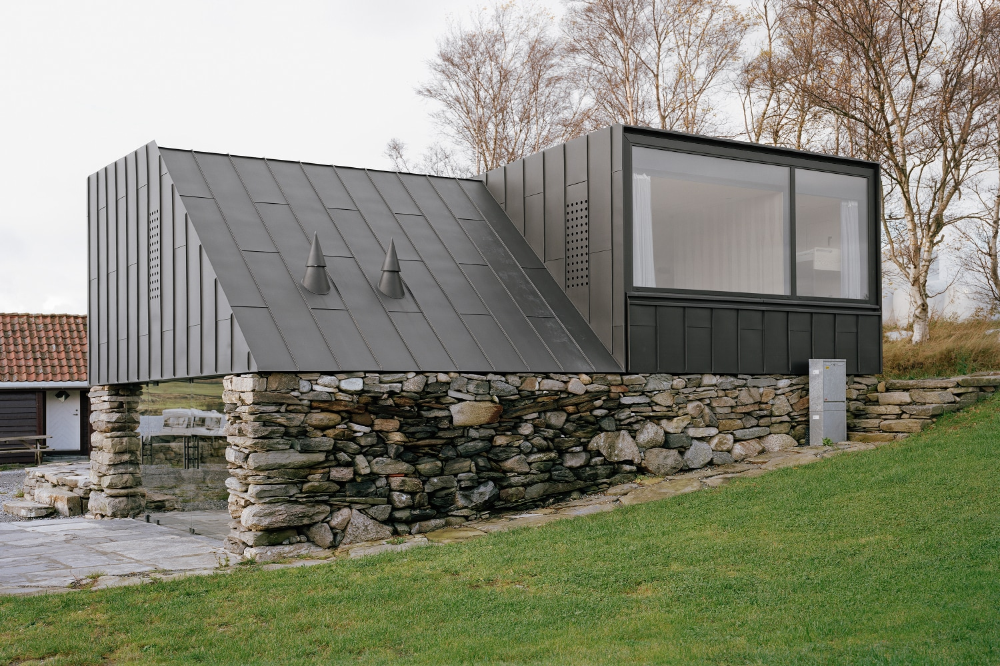 | `claude-opus-4.7` | 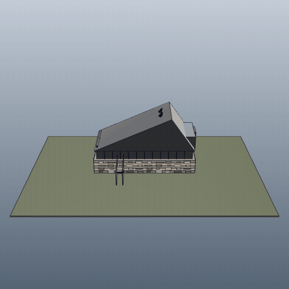 |
| **naust**<br>Espen Surnevikによる切妻屋根のボートハウス（ナウスト）形状の小さな建築模型。基本寸法 約200x100x120mm、急勾配の三角屋根、木材質感、両端に大きな開口部。スカンジナビアン・ミニマルな佇まい。 |  | `codex-gpt-5.5` | 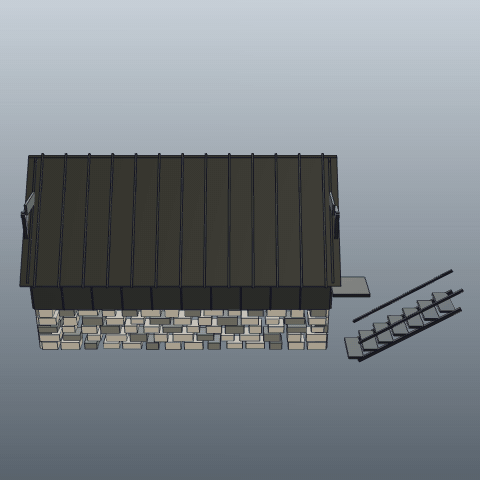 |
| **phone-stand-001**<br>スマートフォン用の卓上スタンド。横置き・縦置き両対応。本体は約100x80x60mm。背面にケーブル通し穴。木質感の見た目。 | — | `claude-opus-4.7` | 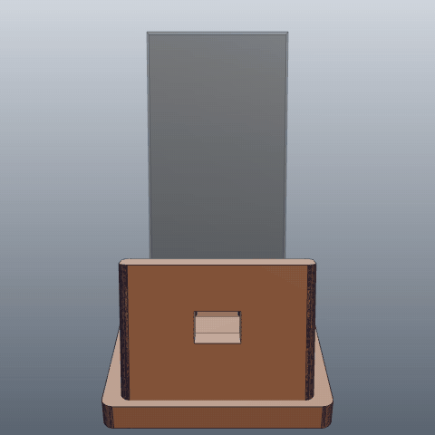 |
| **phone-stand-001**<br>スマートフォン用の卓上スタンド。横置き・縦置き両対応。本体は約100x80x60mm。背面にケーブル通し穴。木質感の見た目。 | — | `codex-gpt-5.5` | 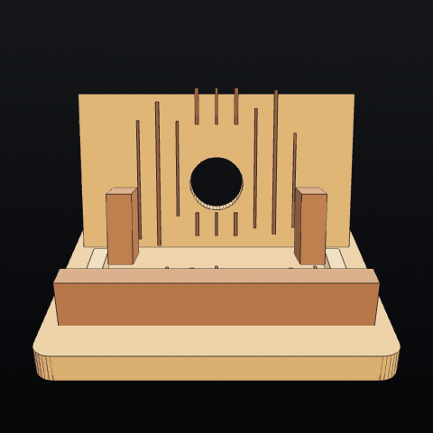 |
| **stando**<br>Guerra Officeによる日本製のキッチン用ピンセット型トング。日本の調理用箸のテーパー形状をベースにし、全長約180mm、先端が細く根本にかけて緩やかに太くなる。中央付近に置いた時に先端が浮く凸部があり、卓上で先端が汚れない設計。マットなステンレス仕上げ。 |  | `claude-opus-4.7` | 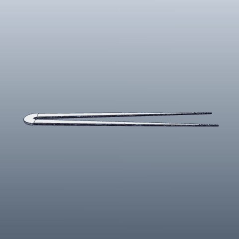 |
| **stando**<br>Guerra Officeによる日本製のキッチン用ピンセット型トング。日本の調理用箸のテーパー形状をベースにし、全長約180mm、先端が細く根本にかけて緩やかに太くなる。中央付近に置いた時に先端が浮く凸部があり、卓上で先端が汚れない設計。マットなステンレス仕上げ。 |  | `codex-gpt-5.5` | 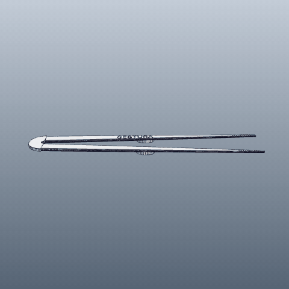 |
| **tracks-headphones**<br>AIAIAI（デザイン: KiBiSi）によるオーバーイヤー型ヘッドフォン。軽量フレーム、円形イヤーカップ直径約90mm、シンプルなヘッドバンド、つや消しブラックとアルミのアクセント。ケーブル着脱式。ミニマルで本質的なフォルム。 | 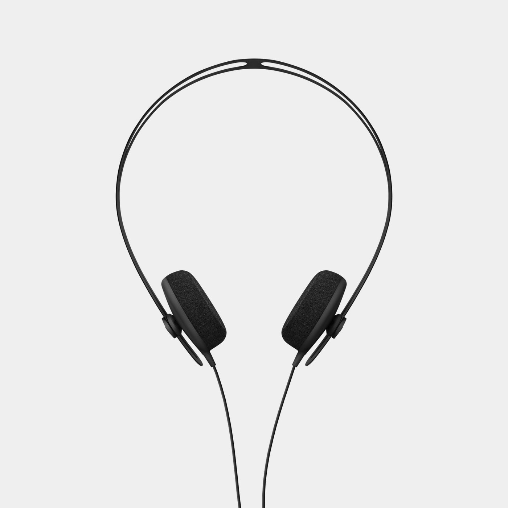 | `claude-opus-4.7` | 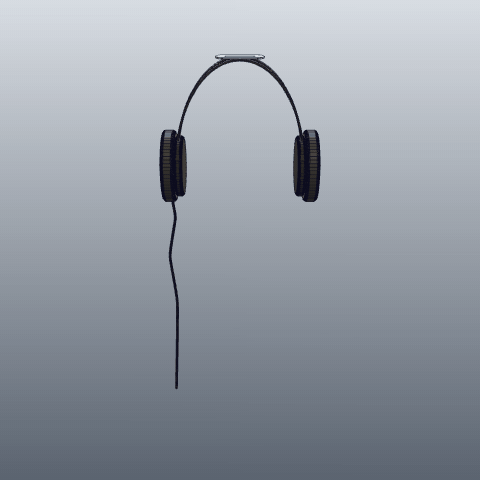 |
| **tracks-headphones**<br>AIAIAI（デザイン: KiBiSi）によるオーバーイヤー型ヘッドフォン。軽量フレーム、円形イヤーカップ直径約90mm、シンプルなヘッドバンド、つや消しブラックとアルミのアクセント。ケーブル着脱式。ミニマルで本質的なフォルム。 |  | `codex-gpt-5.5` | 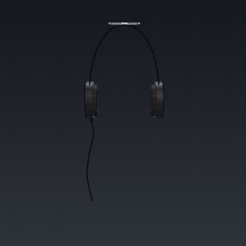 |
| **windmill-fan**<br>Branch Creativeによる卓上扇風機。直径約250mmの円形グリルと細いスタンド、ファン本体厚み約60mm。ホワイトとライトグレーの2トーン、シンプルな操作ボタンが背面に1つのみ。風車を思わせる4枚羽根のミニマルデザイン。 | 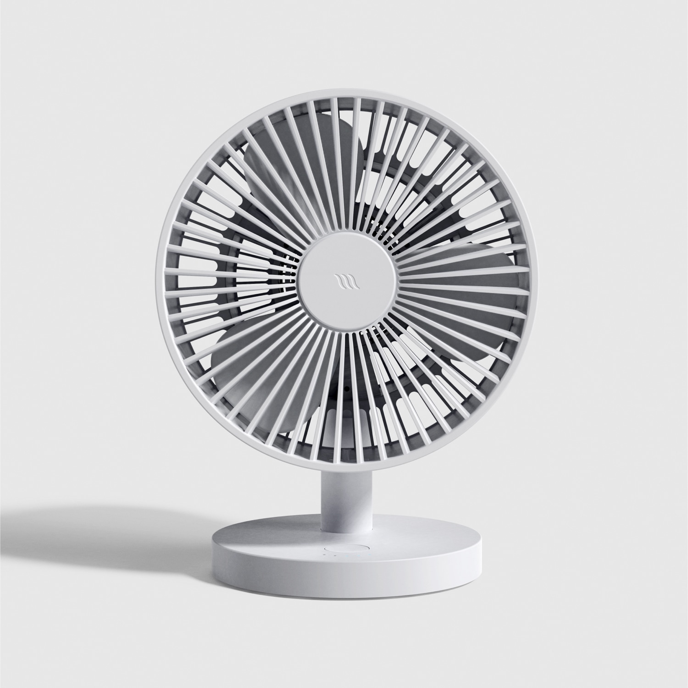 | `claude-opus-4.7` | 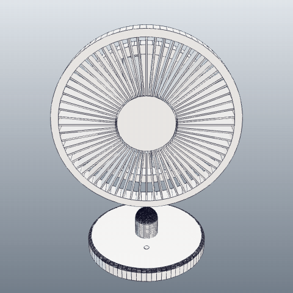 |
| **windmill-fan**<br>Branch Creativeによる卓上扇風機。直径約250mmの円形グリルと細いスタンド、ファン本体厚み約60mm。ホワイトとライトグレーの2トーン、シンプルな操作ボタンが背面に1つのみ。風車を思わせる4枚羽根のミニマルデザイン。 |  | `codex-gpt-5.5` | 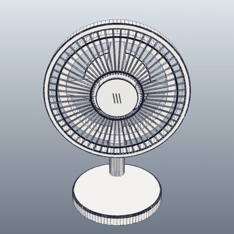 |

<!-- RESULTS_GALLERY_END -->

## Setup

- Node 18+ (tested on 22)
- `claude` CLI on PATH, authenticated
- `codex` CLI on PATH, authenticated (default model from `~/.codex/config.toml`)
- `forgecad` CLI on PATH, authenticated
- ForgeCAD agent skills installed (`forgecad skill install` + symlinked into `~/.claude/skills/` for Claude). Codex doesn't read skill dirs, so the runner injects the full ForgeCAD context blob inline (generated once via `forgecad skill one-file` and cached at `_context/forgecad.md`).
- `ffmpeg` on PATH (for turntable GIF assembly)

## Files

| File | Purpose |
|---|---|
| `prompts.csv` | Source of truth. One row per object. Edit by hand |
| `results.csv` | Auto-generated. One row per (slug × engine) with status, timing, paths |
| `generate.mjs` | Runner. Zero npm deps |
| `_refs/{slug}/...` | Cached reference images |
| `_context/forgecad.md` | Cached ForgeCAD knowledge blob (gitignore-able) |
| `projects/{slug}/{engine}/model.forge.js` | Generated model |
| `projects/{slug}/{engine}/renders/{hero,front,side,top}.png` | Canonical stills |
| `projects/{slug}/{engine}/renders/turntable.gif` | 180° rotation around Z, 18 frames @ 12fps |

## `prompts.csv` schema

| Column | Required | Notes |
|---|---|---|
| `slug` | ✅ | kebab-case. Becomes the folder name under `projects/` |
| `prompt` | ✅ | Japanese/English ok. Describe the object, dimensions, style |
| `reference_urls` |  | `\|`-separated image URLs (jpg/png/webp). Empty = text-only |
| `engines` |  | `\|`-separated engine names. Empty = use `DEFAULT_ENGINES` in `generate.mjs` |
| `notes` |  | Free-form for your own bookkeeping |

Commas inside `prompt` must be quoted with `"`; internal `"` is escaped as `""`.

## Engines

Configured in `generate.mjs` under `ENGINES`. Currently:

| Name | Backend | Notes |
|---|---|---|
| `claude-sonnet` | `claude -p --model sonnet` | Fast & cheap baseline |
| `claude-opus-4.7` | `claude -p --model opus` | Higher quality, slower (~1.5–2x) |
| `codex-gpt-5.5` | `codex exec -m gpt-5.5` | Uses OpenAI's Codex CLI. Prompt sent via stdin (avoids ARG_MAX with the inlined context) |

Default set: `["claude-opus-4.7", "codex-gpt-5.5"]`. Override by editing `DEFAULT_ENGINES` or by setting the `engines` column per row.

## Run

```bash
# all rows × default engines (skip pairs already in results.csv as "done")
node examples/my-example/generate.mjs

# one specific slug, all its engines
node examples/my-example/generate.mjs --slug desk-clock-001

# one specific engine across all rows
node examples/my-example/generate.mjs --engine codex-gpt-5.5

# one specific (slug × engine) pair
node examples/my-example/generate.mjs --slug desk-clock-001 --engine claude-opus-4.7

# re-run even if results.csv says "done"
node examples/my-example/generate.mjs --slug foo --force

# re-render existing model.forge.js files in-place (no agent spawn — fast)
node examples/my-example/generate.mjs --render-only
node examples/my-example/generate.mjs --slug foo --render-only

# parse + plan only
node examples/my-example/generate.mjs --dry-run
```

## What happens per (slug × engine) job

1. Reference URLs (if any) are downloaded to `_refs/{slug}/` (cached).
2. The runner builds an engine-appropriate prompt:
   - **claude**: short, references the `/forgecad-make-a-model` skill (which loads `/forgecad`).
   - **codex**: prepends the full ForgeCAD context blob (~388KB), then the task. Sent via stdin.
3. The agent is spawned (`claude -p` or `codex exec`) and writes `projects/{slug}/{engine}/model.forge.js`. It also runs `forgecad run` and a validation render at `/tmp/{slug}-{engine}-validate.png` to verify before returning.
4. The runner re-runs `forgecad run` to confirm, then renders the canonical deliverables:
   - 4 stills (hero/front/side/top) via single multi-camera `forgecad render 3d` invocation.
   - 18-frame 180° turntable: multi-camera render → rename to sequential frames → `ffmpeg` palettegen + paletteuse → GIF.
5. `results.csv` is rewritten after every job.

## Tuning

Render settings live as constants near the top of `generate.mjs`:

| Constant | Default | Effect |
|---|---|---|
| `STILL_SIZE` | 700 | Pixel size of the 4 still PNGs |
| `STILL_VIEWS` | hero/front/side/top | Add/remove canonical angles |
| `TURNTABLE_FRAMES` | 18 | Frames over the 180° sweep |
| `TURNTABLE_PITCH` | 25 | Camera elevation for the GIF |
| `TURNTABLE_SIZE` | 480 | Pixel size of GIF frames |
| `TURNTABLE_FPS` | 12 | Playback rate |
| `TURNTABLE_PALETTE_COLORS` | 128 | ffmpeg palettegen — lower = smaller GIF |
| `PER_ROW_TIMEOUT_MS` | 15 min | Per-job timeout (agent only — render is separate) |

To add a new engine, append to `ENGINES` and (optionally) to `DEFAULT_ENGINES`.

## results.csv columns

| Column | Notes |
|---|---|
| `slug`, `engine` | Composite key |
| `status` | `done` / `done-no-renders` / `failed` / `pending` |
| `model_path`, `hero_path`, `gif_path` | Repo-relative paths to artifacts |
| `agent_seconds` | Time spent in the agent subprocess |
| `render_seconds` | Time spent in `forgecad render 3d` + ffmpeg |
| `error` | Failure detail if status ≠ `done` |

## Comparison logs

After all engines for a slug complete (and on every subsequent run when a new engine result appears), the runner spawns **claude-sonnet** with the prompt + reference images + every engine's `hero.png` and writes `projects/{slug}/COMPARISON.md`. The file starts with an auto-generated metrics header (agent time, render time, model file size, parts count, param count per engine), then the LLM-written review covering: overall verdict, per-engine right/wrong, common failures, recommendation. ~$0.10 per slug, ~45s.

Trigger manually for an existing slug with both engines done:
```bash
node examples/my-example/generate.mjs --slug analogue-pocket-aluminum
# planner reports "0 agent job(s), 1 comparison(s)" and runs only the comparison
```

## Scheduling (macOS launchd)

A daily 09:00 run is set up via `com.shintaro.forgecad-pipeline.plist`. It processes only `pending` (slug × engine) pairs that aren't in `results.csv` as `done`, then generates / refreshes COMPARISON.md for any slug whose review is missing or stale.

**Install** (one time):
```bash
cp examples/my-example/com.shintaro.forgecad-pipeline.plist ~/Library/LaunchAgents/
launchctl bootstrap gui/$(id -u) ~/Library/LaunchAgents/com.shintaro.forgecad-pipeline.plist
launchctl print gui/$(id -u)/com.shintaro.forgecad-pipeline | head -20    # verify loaded
```

**Manually fire it right now** (without waiting for 09:00):
```bash
launchctl kickstart -k gui/$(id -u)/com.shintaro.forgecad-pipeline
tail -f examples/my-example/_logs/run.log
```

**Or run the wrapper directly** (no launchd involved):
```bash
bash examples/my-example/scheduled-run.sh
```

**Disable / uninstall**:
```bash
launchctl bootout gui/$(id -u)/com.shintaro.forgecad-pipeline
rm ~/Library/LaunchAgents/com.shintaro.forgecad-pipeline.plist
```

**Change the time**: edit `Hour` / `Minute` in the plist, then `bootout` + `bootstrap` again to reload (launchd does not hot-reload changes).

**Logs**: `_logs/run.log` (timestamped per-invocation), `_logs/launchd.out.log` / `_logs/launchd.err.log` (anything launchd captures before the wrapper takes over).

**Single-instance guard**: `scheduled-run.sh` writes a `run.lock` PID file and skips if the previous day's run is still in progress.

**Cost ceiling**: pending-only mode = no work if no new prompts. If you add 1 new slug per day with the default 2 engines, expect ~$2–4/day (opus + codex + sonnet-compare).

## Common failure modes

| Symptom | Likely cause | Fix |
|---|---|---|
| `forgecad run exited N: ...` | Generated code has a runtime error the agent didn't catch | Inspect `projects/{slug}/{engine}/model.forge.js`. Re-run with `--force` and a tighter prompt, or hand-fix |
| `{bin} exited 0 but model.forge.js not found` | Agent skipped writing the file | Strengthen the prompt; re-run with `--force` |
| `timeout after Ns` | Agent exceeded `PER_ROW_TIMEOUT_MS` | Increase the constant or simplify the prompt |
| `fetch ... failed: 403` | Reference URL needs auth or is hot-link protected | Save the image manually into `_refs/{slug}/01.png` and re-run (cache is honored) |
| status = `done-no-renders` | `forgecad run` passed but stills/GIF failed | Read `error`. Re-run with `--render-only --slug X` after fixing the underlying issue |
| Codex prompt too large | Inlined context blob + huge prompt + image attachments | Reduce context — generate a slimmer `_context/forgecad.md` by hand and avoid re-generating it |
